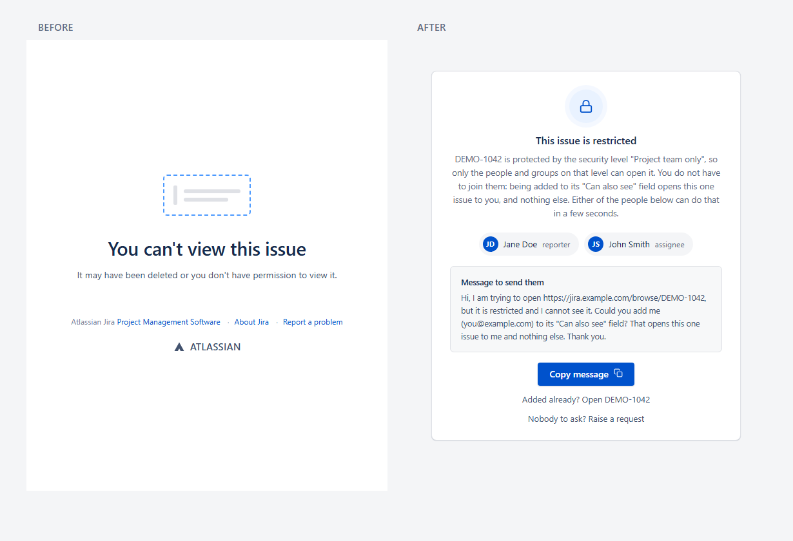
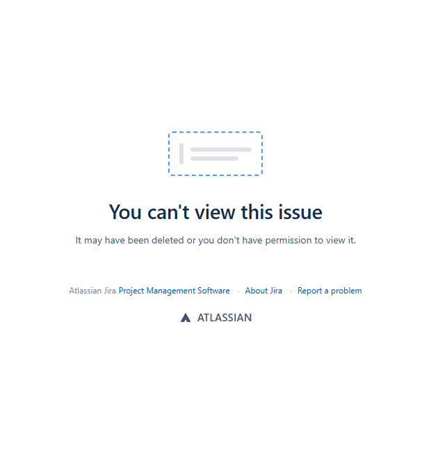
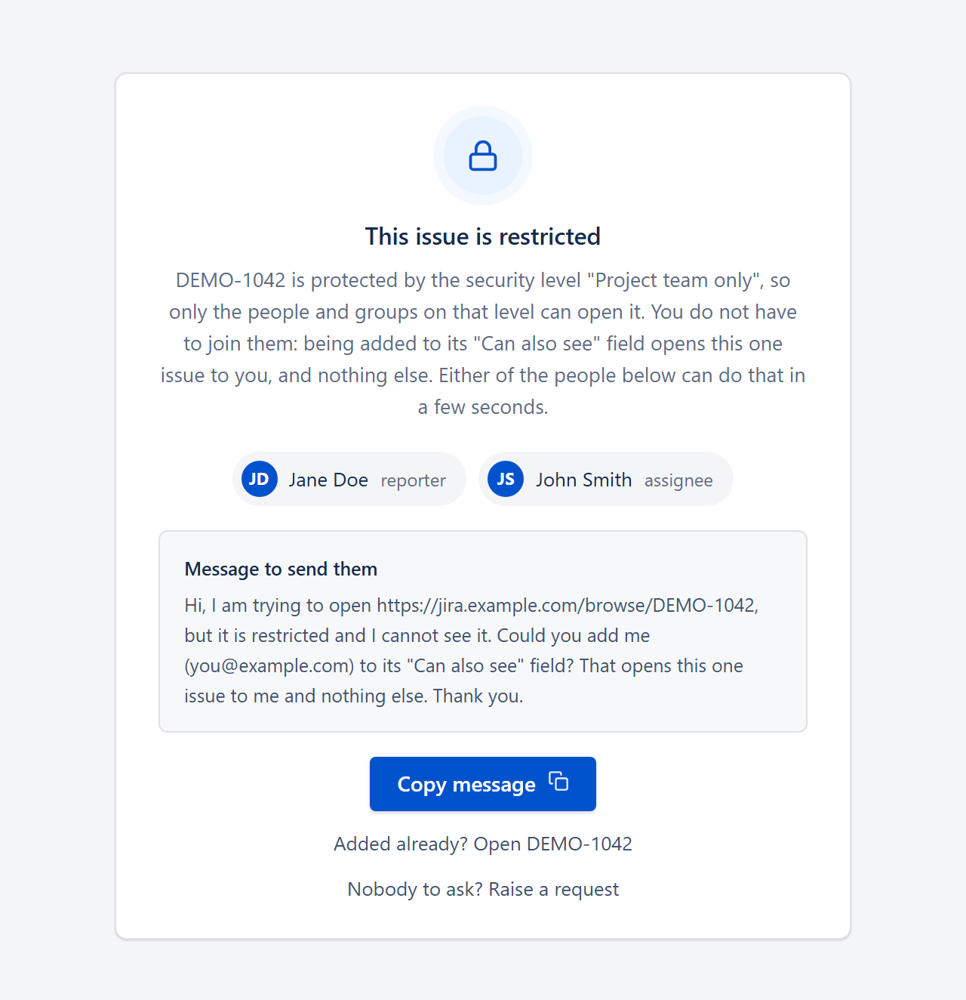
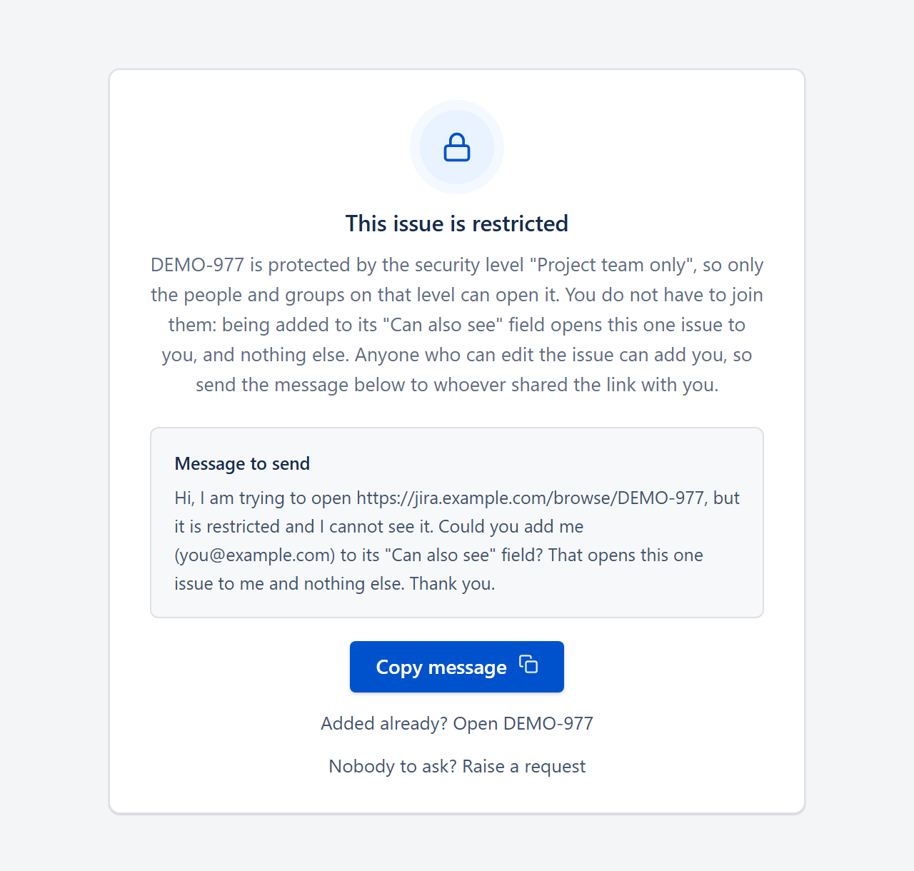
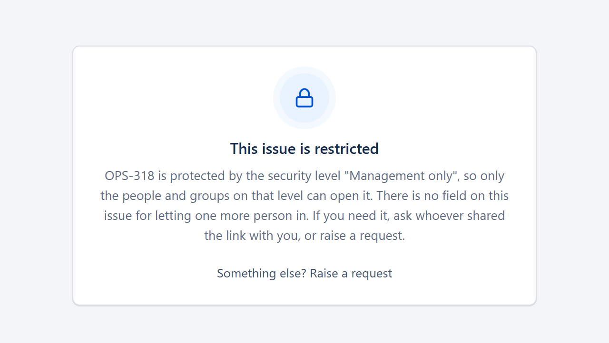

# Jira Restricted Issue Helper

A ScriptRunner web fragment for Jira Data Center that replaces the "You can't view this issue" dead end with a card that says what is actually blocking the viewer and who can let them in, and that decides, per viewer, how much it is allowed to say.



*All screenshots in this repository use invented data.*

## The problem

When an issue carries an issue security level the viewer is not on, Jira answers: "It may have been deleted or you don't have permission to view it." That sentence sends people in the wrong direction. They ask a Jira administrator, and an administrator does not bypass issue security either, so two people are now blocked instead of one.

The real fix is usually small. Many security levels also grant access through a multi-user picker field on the issue itself (a "can also see" field). Anyone who can edit the issue can add one more name, and that opens this one issue to that one person and nothing else. The blocked viewer has no way to know that, or whom to ask. The card tells them, with a copy-ready message.

## What already exists

As far as I could find:

- The field is not a trick of this project. A multi-user picker field on a security level is Atlassian's documented workaround for [JRASERVER-45488](https://jira.atlassian.com/browse/JRASERVER-45488) (watchers cannot see issues under a security level, 126 votes at the time of writing), and the mechanism behind [JSDSERVER-3948](https://jira.atlassian.com/browse/JSDSERVER-3948) (request participants cannot see issues under a security level, 367 votes). The card only tells a blocked viewer that such a field exists and who can fill it in.
- A "request access" button for Data Center has been requested since 2016 in [JRASERVER-59366](https://jira.atlassian.com/browse/JRASERVER-59366), which is at Gathering Interest with 57 votes. Jira Cloud now has a native Request access button on a work item you can't view: the request goes to the project administrators and grants a project role. The field this card points at opens one issue, not a project.
- No Marketplace app replaces this page on Data Center. The built-in Permission Helper answers the question for administrators only.

## What the card does

The fragment renders nothing on pages that work. On the two dead-end pages, `/browse/<KEY>` and the Jira Service Management agent view, it replaces the error block with one card, in one of five modes:

| Mode | When | What the viewer gets |
|---|---|---|
| `secured` | the issue's security level is what hides it, and the viewer passes every disclosure gate | the level's name, the field that opens this one issue, up to two people who can add them, a copy-ready message. `DISCLOSURE` can withhold the name, the field or the people |
| `portal` | a Service Management request the viewer can open on the customer portal | a button straight to the request on the portal |
| `share` | a request the viewer is not on, whose reporter can add them with the portal Share button | the reporter's display name and a copy-ready message |
| `moved` | a former request that was moved out of the service desk | its new key and project, instead of a Help Center that will never list it |
| `generic` | anything else, including every viewer who fails a gate | the Help Center and a link to raise a request |

| Stock Jira | Restricted, two people can help |
|---|---|
|  |  |

| Restricted, nobody to name | Restricted, no field to suggest |
|---|---|
|  |  |

## The hard part: saying who can help is a disclosure

A card that names a security level, a field and the people on an issue tells the viewer that the issue exists, what kind of compartment it sits in, and who is involved. On some levels, the name and the members are exactly what the level protects. So every decision is made on the server, before anything is sent, and the restricted card appears only when all of these hold:

1. the viewer is verifiably internal, under a policy you choose and configure (e-mail domain, or group membership);
2. the level is in a scheme you opted in, and not on your list of compartments whose name is the secret;
3. the issue is editable right now, in a project that is not archived;
4. being added to the field would really let the viewer in: the permission scheme, with issue security left out, already grants them Browse on this issue, or grants it through that very field.

A viewer who fails any gate keeps the generic card, which reads the same whether the issue exists or not. For a viewer who passes, `DISCLOSURE` decides what the card may say: the level's name, the field's name and the people can each be withheld, globally or per level. It trims the content after the gates; it never widens who gets the card. [docs/DESIGN.md](docs/DESIGN.md) sets out the full disclosure model.

## Scenarios

Five profiles are assembled and committed in [dist/](dist/). Each is one file, ready to paste into the fragment once its CONFIG block holds your values.

| Profile | For | What is in it |
|---|---|---|
| `full` | Service Management and issue security levels. This is what the author runs in production | every mode; internal viewers by e-mail domain |
| `jsm-only` | Service Management, where the helper should not talk about security levels at all | `portal`, `share`, `moved` and `generic`; no restricted card, so no internal-viewer policy |
| `no-jsm` | Jira Software or Jira Core without Service Management | `secured` and `generic`; the links and texts stop mentioning the Help Center and requests, "raise a request" leads to the stock Contact Administrators form (which must be switched on), and the generic card's button to the dashboard |
| `secured-minimal` | organisations that want the restricted card but not its names | the same modules as `full`, with `DISCLOSURE` all off: no level name, no field name, no people |
| `group-policy` | directories whose usernames are logins rather than e-mail addresses | the same as `full`, with "internal" defined by membership of `INTERNAL_GROUPS` |

[docs/RECIPES.md](docs/RECIPES.md) starts from a situation and says which profile to take and which values to change.

## Assemble your own

The source in [src/](src/) is split into modules: configuration and texts, the core, policies (who counts as internal, whom to name), modes (one file per card) and the renderer. A profile in [profiles/](profiles/) lists the modules to include and any CONFIG or TEXT values to override, and `python build/assemble.py --profile <name>` joins them into one file, `dist/<name>.groovy`. [docs/RECIPES.md](docs/RECIPES.md) covers the common variations; [docs/EXTENDING.md](docs/EXTENDING.md) explains the contract of a mode and of a policy, and how to add your own from `src/modes/_template.groovy`. Whatever you assemble, you still deploy one file.

## Requirements

- **Jira Data Center 8.0 to 11.x by Javadoc; run in production by the author on 9.x with ScriptRunner 8.x; other combinations not tested.** "By Javadoc" means that every Jira API call the fragment makes is present with the same signature in the official Javadoc of Jira Data Center 8.0.0 to 11.3.4, and every Service Management API call in Jira Service Management 4.0.0 to 11.3.4 (all `@PublicApi`), checked on 2026-09-28.
- **ScriptRunner for Jira** with Script Fragments, in the major that Marketplace lists for your Jira. The fragment type is called "Show a web panel" in ScriptRunner's documentation.

  | Jira Data Center | Jira Service Management | ScriptRunner (per Marketplace) | Groovy |
  |---|---|---|---|
  | 8.x | 4.x | 6.x, 7.x or 8.x | 2.5.11 (6.x), 3.0.12 (7.x), 4.0.7 (8.x) |
  | 9.x | 5.x | 8.x (7.x up to Jira 9.7.2) | 4.0.7 (8.x), 3.0.12 (7.x) |
  | 10.x | 10.x | 9.x only | 4 |
  | 11.x | 11.x | 10.x only | 4 |

- **Jira Service Management is optional.** The `portal`, `share` and `moved` modes concern Service Management requests (current ones, and issues that used to be requests); the `secured` and `generic` cards work on every project.

The Javadoc check does not cover everything:

- the location `atl.header.after.scripts` is not documented by Atlassian or Adaptavist. It is seen in Jira sources from 7.1 to 9.12; on 10.x and 11.x, confirm it with ScriptRunner's Fragment Locator before you rely on it;
- the DOM hooks `.issue-error` and `#unlicensed-project-type` are confirmed only by the author's production instance (Jira 9.x, ScriptRunner 8.x);
- `PermissionSchemeManager.hasSchemePermission` is the one `@Internal` API the restricted card depends on, and `Project.isArchived()` is `@ExperimentalApi` (present since 7.9.0). If either call fails, the viewer gets the generic card.

[docs/COMPATIBILITY.md](docs/COMPATIBILITY.md) has the details and the sources.

The script fragment mechanism this relies on exists on Data Center. On Cloud, the equivalent would need a different approach, and Cloud has its own Request access button (above).

## Quick start

Without Python:

1. Pick a profile from [Scenarios](#scenarios) and copy `dist/<profile>.groovy` to a private file. A name ending in `.local.groovy` keeps it out of git.
2. Set your values in its `CONFIG` block, between `// >>> CONFIG` and `// <<< CONFIG`. Every value is documented in [docs/CONFIG.md](docs/CONFIG.md); the defaults are placeholders and keep the restricted card switched off until you replace them.
3. Create the fragment: type "Show a web panel", location `atl.header.after.scripts`, weight 100, no condition, and paste the whole file as its script. Step by step, with the checks to run after saving: [docs/INSTALL.md](docs/INSTALL.md).

With Python 3.10 or later, additionally:

1. Change a profile, or the modules in `src/`, and rebuild: `python build/assemble.py --profile <name>`. The build refuses a profile whose modules miss a dependency and fails if a comment reaches the client script.
2. Refresh the tests from your configured copy, `python build/sync_tests.py --source <your file>`, and paste each file in [tests/](tests/) into the ScriptRunner Script Console (see [tests/README.md](tests/README.md)).

## Why the client script carries no comments

Everything inside `writer.write($/ ... /$)` is sent to every browser that receives a card: open the page source and it is there, comments included. Server-side Groovy comments never leave the server. This is not theoretical. In an earlier internal version, two developer comments in the client script, one holding a real display name and one an internal issue key, reached every browser that got a card. Reviews had covered the card's text, the server logic and the client's behaviour; the comments rode along in the bytes.

So the assembled files carry no client comments at all. The source of the client script, [src/render/client.js](src/render/client.js), explains itself in full-line comments that [build/assemble.py](build/assemble.py) removes when it inlines the file; the build then runs [build/strip_client_comments.py](build/strip_client_comments.py) `--check` on the result and fails if a comment or a stray dollar sign survives. See [build/README.md](build/README.md).

## What it does not cover

- Other pages that show an issue: browse URLs with `?jql=` or `?filter=`, boards and backlogs (`RapidBoard.jspa?...selectedIssue=`), the REST API and the mobile app. The fragment only acts on `/browse/<KEY>` and the agent view.
- A viewer who lacks Browse on an ordinary Jira project gets the generic card. The card does not name project leads or administrators.
- On the customer portal side, `portal` and `share` cover a request the viewer can open and one its reporter can share. They do not explain a request without a request type, a security level that excludes the portal's customers, or an inactive or duplicate account.

## Repository layout

```
src/config/config.groovy         every CONFIG value, with comments
src/config/text.en.groovy        TEXT: every string the card shows
src/core/                        context (shared helpers, the mode registry), decide, entry
src/policy/                      internal-mail-domain, internal-group, people-reporter-assignee, jsm
src/modes/                       portal, share, moved, secured, and _template for your own
src/render/                      render.groovy (payload to inline script), client.js (the browser script)
profiles/*.profile               which modules, and which CONFIG and TEXT overrides, make each build
dist/*.groovy                    the five assembled profiles, ready to paste
build/assemble.py                joins a profile into dist/<profile>.groovy
build/strip_client_comments.py   strips and checks comments in client script blocks
build/sync_tests.py              copies the deployed sections into the tests
tests/decision_test.groovy       decide() against viewer and issue pairs on your instance
tests/decision_test_secured_off.groovy  the kill switch restores the generic card
tests/render_test.groovy         every card variant, rendered from synthetic payloads
docs/DESIGN.md                   the disclosure model and the gates
docs/INSTALL.md                  install, upgrade, rollback
docs/CONFIG.md                   every configurable value and text
docs/RECIPES.md                  situation to profile to values
docs/EXTENDING.md                how to add a mode or a policy
docs/COMPATIBILITY.md            Jira, Service Management, ScriptRunner and Groovy versions
```

Contributions: [CONTRIBUTING.md](CONTRIBUTING.md).

## Security

What the card never discloses, the known limitations, and how to report a vulnerability: [SECURITY.md](SECURITY.md).

## Licence

MIT. See [LICENSE](LICENSE).
